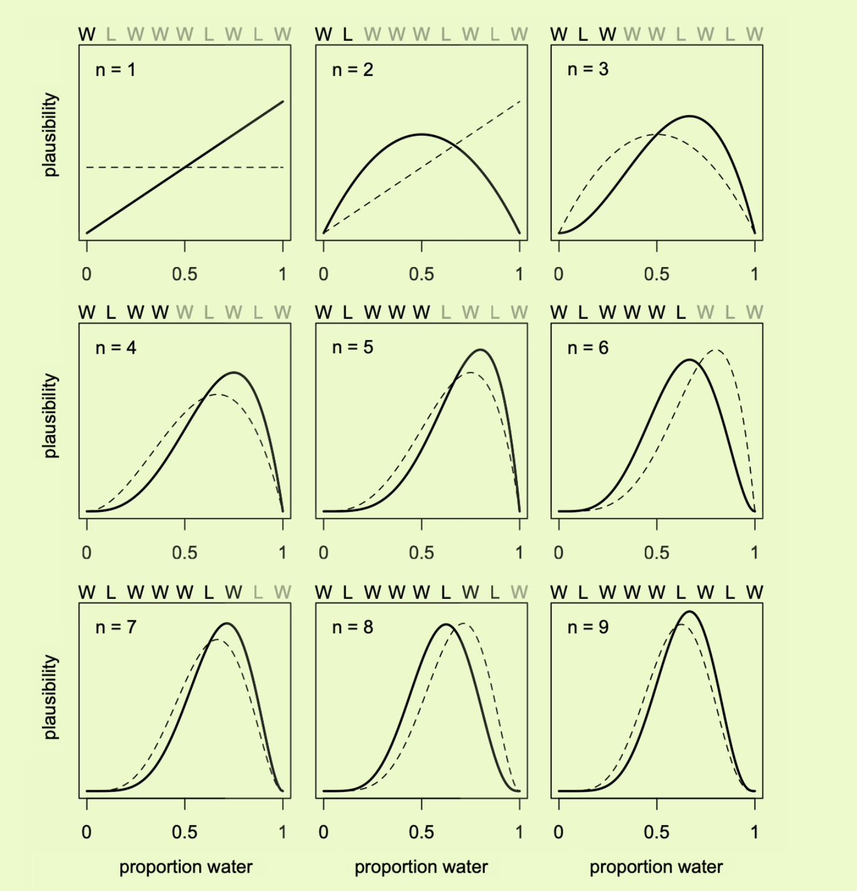

# 第二章 模型组成

## 1.likelihode	

### 似然函数定义：定义观测可能性的数学公式

e.g.：地球表面水的覆盖比例

the sample is WLWWLWLW

这个例子中 N =9 

如果想要知道所有相同长度的观测序列出现在当前观测的可能性

可以加上自己的假设，

1.各个投掷是独立的

2.每次投掷得到W的概率都相同

#### 二项式分布binom

$Pr(w|n,p) =\frac{(n)!}{ n!(n-w)!} p^W(1 − p)^{n-w}$

if p=0.5 and n=9

observed 6times W 

$Pr(6| 9,0.5) =\frac{(9)!}{ 9!(9-6)!} 0.5^6(1-0.5)^{9-6}$

P = 0.16

## 2.parameters

the parameter is binormial 

P(w of P )  n (sample ) with W (observed w times) 是可变的

in this example n and w is data ,and ist don't have error ,so the unknow variable is p

in stat  offen ask about data question ,we can used parameters anwserd it：

1.各组之间的平均差异

2.处理(训练阶段)和结果(测试集)之间的联系多强

3.处理和结果的影响是否取决于其中的某个变量

4.各组之间的差异有多大

## 3.prior

将概率分布作为先验：

$Pr(p) = \frac{1}{1-0}=1$

a to b 的均匀分布的概率为1/b-a

where are prior from ，水平先验很常见，但不是最优

高低起伏的先验可以提高推断标准化 或者弱信息先验

